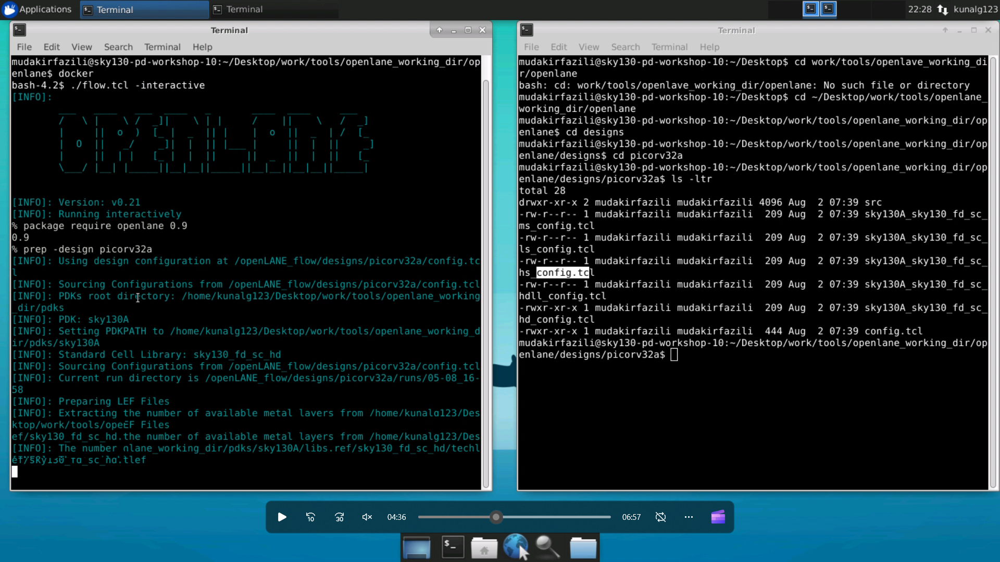
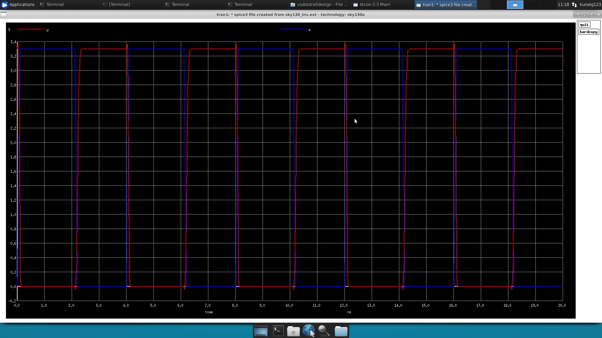

# ADVANCE PHYSICAL DESIGN WORKSHOP USING SKYWATER 130NM PDK

This repository contains the files generated through out the workshop. 

# Table of Contents
- [Introduction](#introduction)
- [Conclusion](#conclusion)
- [Author](#author)
- [Acknowledgements](#acknowledgements)
- [References](#references)

# Introduction

This repository provides a step by step guide of openlane flow.

```
docker
./flow.tcl -interactive
package require openlane 0.9
prep -design picorv32a
```



```
run_synthesis
```


```
run_floorplan
```


```
run_placement
```

```
magic -T sky130A.tech sky130_inv.mag &
```


```
extract all
ext2spice cthresh 0 rthresh 0
ext2spice
```


```
ngspice sky130_inv.spice 
```

```
plot y vs time a
```



# Conclusion


# Author
[**Mohammad Mudakir Fazili**](https://www.linkedin.com/in/mudakirfazili14/), *M.Tech Micro-electronics*, NIT Srinagar                                                                                           
*mudakirfazili@gmail.com*

# Acknowledgements
1. [VLSI System Design Corporation](https://www.vlsisystemdesign.com/)
2. [Efabless](https://efabless.com)

A special vote of thanks to **Kunal Ghosh** (founder VSD)
